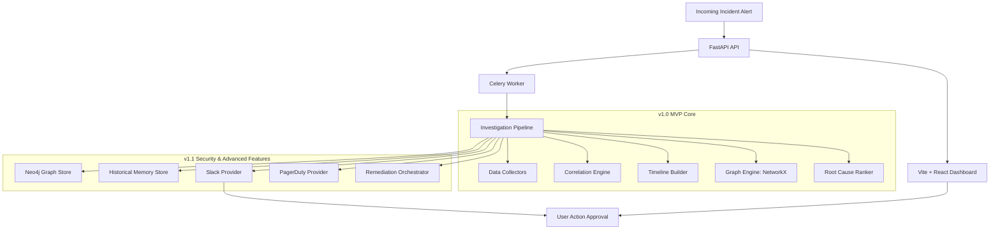

# Research: Architecture Integration

This document outlines how the target features for milestone v1.1 integrate with the existing OpenSRE architecture.

## Integration Points

### 1. Notification Hook (`backend/app/providers/notifications.py`)
* We will define a `NotificationProvider` abstraction and register specific implementations for Slack and PagerDuty.
* **Pipeline Hook**: The `InvestigationPipeline` will emit lifecycle events (started, stage_transition, completed) to the notification router.

### 2. Neo4j Graph Integration (`backend/app/providers/graph/neo4j.py`)
* We will implement `Neo4jProvider` conforming to the existing `GraphProvider` interface.
* The pipeline will write/sync the computed NetworkX graph into the Neo4j graph database at the end of the `graph` stage.

### 3. Incident Memory Engine (`backend/app/domain/incidents/memory.py`)
* We will create a `MemoryEngine` that serializes findings into text embeddings.
* During the `hypothesize` and `rank` stages, the `RootCauseRanker` will invoke the `MemoryEngine` to fetch similar historical incidents from SQLite and adjust hypothesis ranks based on past patterns.

### 4. Remediation Orchestration (`backend/app/domain/remediation/`)
* We will implement a stateful `RemediationOrchestrator` service that handles proposed scripts, runs safety checks, transitions status to `PENDING_APPROVAL`, and executes them asynchronously via Celery upon approval.

### 5. API Extensions (`backend/app/main.py`)
* New endpoints to support:
  * Fetching timelines, dependency graphs, and incident reports for the dashboard UI.
  * Receiving interactive Slack action webhook callbacks.
  * Executing manual approvals for remediation scripts.

---

## Suggested Build Order

1. **Phase 1: Neo4j Storage Layer**
   * Abstract graph persistence and implement Neo4j connection pool and node/edge sync.
2. **Phase 2: Notification System**
   * Set up Slack API client + Block Kit templates and PagerDuty integration. Add webhook endpoint for callbacks.
3. **Phase 3: Historical Incident Memory**
   * Build vector storage in SQLite and cosine similarity matching inside `RootCauseRanker`.
4. **Phase 4: Human-in-the-Loop Remediation**
   * Define safety boundaries, build the stateful approval flow, and run validation.
5. **Phase 5: Web Dashboard UI**
   * Create Vite + React SPA, implement timeline viz, D3 graph display, and connect to FastAPI endpoints.
